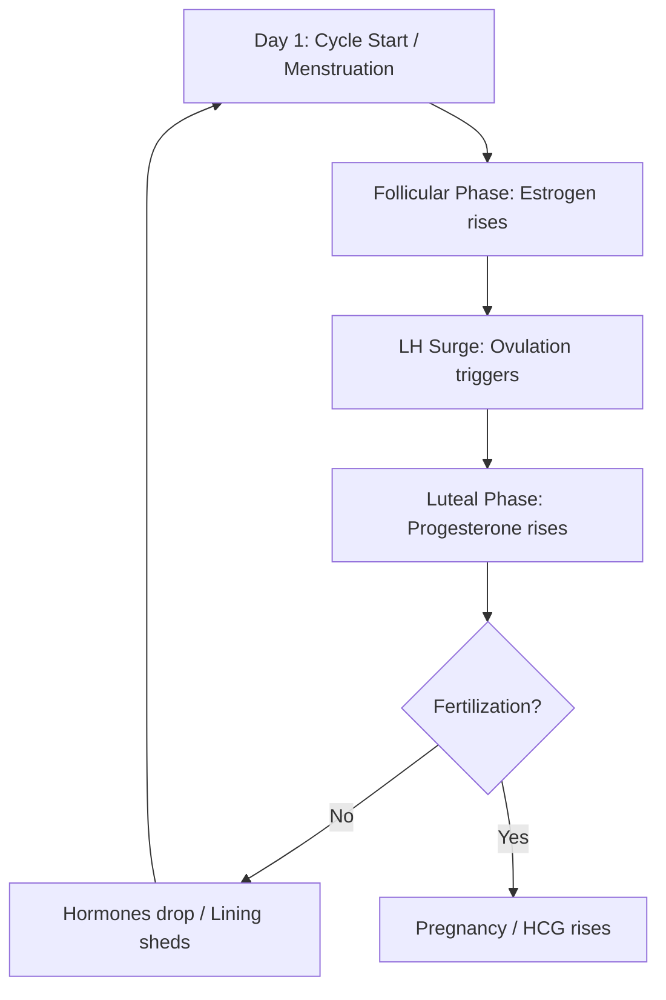

# Biological Cycle Engine & Symptothermal Calculations

This document details the core biological logic, mathematical formulas, and clinical protocols implemented within Selene's cycle tracking engine (`src/utils/cycleEngine.js`).

---

## 1. Ovarian & Uterine Physiology

The menstrual cycle is modeled around two primary physiological cycles running concurrently:

1. **The Ovarian Cycle:** Focuses on follicle growth, ovulation, and corpus luteum formation.
2. **The Uterine (Endometrial) Cycle:** Focuses on shedding the uterine lining (menstruation) and rebuilding it (proliferation).



---

## 2. Mathematical Formulas & Engine Logic

Rather than assuming a static, generic 28-day model, Selene utilizes an **adaptive mathematical simulation** that updates in real-time as logs are added.

### A. Dynamic Cycle Length ($L_i$)
A cycle length is defined as the number of days from the start of one period log to the start of the next chronological period log.
$$L_i = \text{Date}(\text{Start}_{i+1}) - \text{Date}(\text{Start}_i)$$

### B. Rolling Average Cycle Length ($\text{Avg } L$)
Computed retrospectively using all completed historical cycle lengths:
$$\text{Avg } L = \frac{1}{N-1} \sum_{i=1}^{N-1} L_i$$
*If the user has fewer than 2 logged periods, Selene falls back to the configured onboarding baseline (defaulting to 28 days).*

### C. Average Period Duration ($\text{Avg } D$)
Calculated exclusively from completed periods (where an end date is explicitly logged):
$$\text{Avg } D = \frac{1}{M} \sum_{j=1}^{M} (\text{End}_j - \text{Start}_j + 1)$$
*Default fallback: 5 days.*

### D. Ovulation Date Estimation ($O$)
Biologically, the luteal phase (post-ovulation) remains highly consistent in duration (typically 14 days) compared to the follicular phase. Selene projects the ovulation date by subtracting 14 days from the projected start of the next cycle:
$$O = \text{Start}_{\text{next}} - 14 \text{ days}$$
For completed historical cycles, the ovulation date is calculated retrospectively as:
$$O_i = \text{Start}_i + (L_i - 14)$$

### E. Fertile (Unsafe) Window Bounds
Modeled based on sperm longevity inside the female reproductive tract (up to 5 days) and the viability of the released egg (24 hours):
$$\text{Fertile Window} = [O - 5 \text{ days},\, O + 1 \text{ day}]$$
Any day falling inside this range is classified as **High Fertility (Unsafe Window)**.

---

## 3. Symptothermal Double-Check Protocol

Calendar projections are mathematical estimations. To verify ovulation, Selene utilizes the **Symptothermal Method**, which cross-references projections with physical biological markers:

### A. Basal Body Temperature (BBT) Thermal Shift
Progesterone secreted by the corpus luteum immediately post-ovulation causes a sustained rise in waking body temperature:
* **The Thermal Shift:** A shift of **$0.3^\circ\text{C}$ to $0.5^\circ\text{C}$** above the pre-ovulatory baseline.
* **The 3-over-6 Rule:** Ovulation is confirmed when there are 3 consecutive daily temperatures recorded that are higher than the previous 6 days' temperatures.

### B. Cervical Mucus Consistency
Estrogen levels rise sharply prior to ovulation, transforming cervical fluid:
* **High Fertility Fluid:** Wet, slippery, clear, and highly stretchy (resembling raw egg-whites). This texture acts as a biological medium that keeps sperm alive and guides them through the cervix.
* **Low Fertility Fluid:** Thick, sticky, or dry consistency, which forms a barrier to sperm passage.

```
                    ESTROGEN SURGE          PROGESTERONE SURGE
                    (Pre-ovulation)          (Post-ovulation)
                    
Mucus Consistency:  Egg-White (Stretchy) ──> Dry / Sticky
Waking Temp (BBT):  Pre-shift Baseline   ──> Thermal Shift (+0.3°C to 0.5°C)
Fertility State:   [  HIGH FERTILITY  ]     [   LOW FERTILITY  ]
```

---

## 4. Precedence of Day Classifications

To ensure safety and clarity, Selene classifies each day by running through a strict precedence hierarchy:

1. **Logged Menstrual Period:** Direct user confirmation of active bleeding.
2. **Logged Ovulation:** Verified via symptothermal shift.
3. **Logged Unsafe Window:** Unsafe window calculated from historical completed cycles.
4. **Projected Period:** Estimated next cycle start date.
5. **Projected Ovulation:** Predicted ovulation date based on rolling averages.
6. **Projected Unsafe Window:** Predicted fertile window based on rolling averages.
7. **Safe Day:** Outside of all fertile and bleeding bounds.
