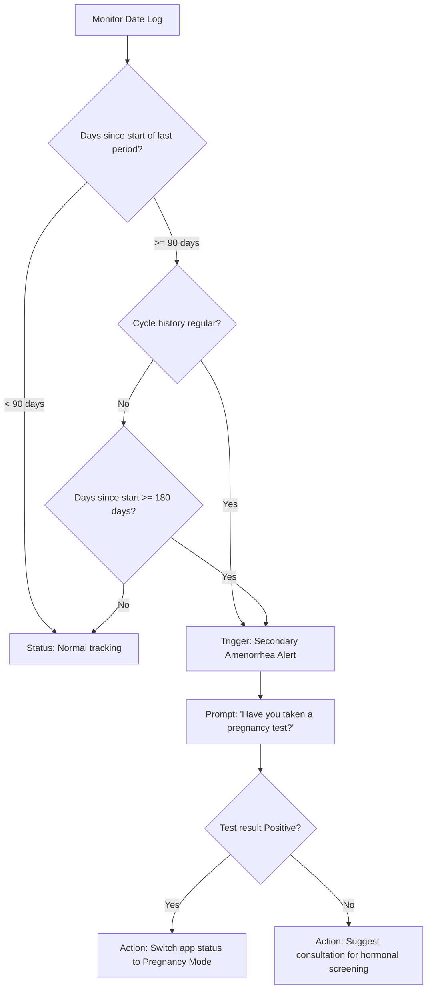
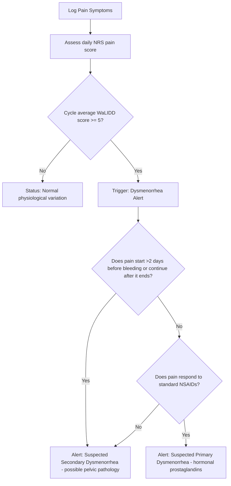

# Clinical Research: Menstrual Volume, Frequency, & Pain Abnormalities

This document details the physiological definitions, clinical baselines, and assessment algorithms planned for Selene's future clinical insights engine, including Amenorrhea and Dysmenorrhea.

---

## 🩸 1. Clinical Classifications

Menstrual cycle abnormalities are grouped into three primary dimensions: **Frequency** (cycle timing), **Volume** (blood loss amount), and **Symptom Severity** (pain and distress).

```
MENSTRUAL DISORDERS
 ├── Frequency (Days)
 │    ├── Polymenorrhea  (<21 days)
 │    └── Oligomenorrhea (>35 days)
 ├── Volume (Volume/Duration)
 │    ├── Hypomenorrhea  (<30 mL or <2 days)
 │    └── Hypermenorrhea / Menorrhagia (>80 mL or >7 days)
 └── Symptom Severity & Absence
      ├── Amenorrhea (Absence of menses)
      └── Dysmenorrhea (Painful menstruation)
```

### A. Amenorrhea (Absence of Menstruation)
Amenorrhea is classified into two types:
1.  **Primary Amenorrhea:** The absence of menarche (first period) by age 15 in girls with normal growth and secondary sexual characteristics.
2.  **Secondary Amenorrhea:** The absence of menses in individuals who previously menstruated.
    *   **Diagnostic Criteria:** 
        *   **3 months** of absent menses in individuals with previously **regular** cycles.
        *   **6 months** of absent menses in individuals with previously **irregular** cycles.
    *   **Primary Screening Checkpoint:** Pregnancy is the most common cause of secondary amenorrhea and must always be ruled out first using a urine or blood $\beta$-hCG test. Other causes include Polycystic Ovary Syndrome (PCOS), thyroid abnormalities, hypothalamic stress, and premature ovarian insufficiency.

### B. Dysmenorrhea (Painful Menstruation)
Dysmenorrhea refers to painful uterine cramping during menstruation, classified as:
1.  **Primary Dysmenorrhea:** Pain associated with normal ovulatory cycles, caused by excessive prostaglandin release in the endometrium during uterine contractions. Usually begins 1–2 days before bleeding and peaks during the first 24–48 hours.
2.  **Secondary Dysmenorrhea:** Pain caused by underlying pelvic pathology (e.g., endometriosis, adenomyosis, uterine fibroids, or pelvic inflammatory disease). Typically starts earlier in the cycle, lasts longer than bleeding, and is often less responsive to NSAIDs.

---

## 📊 2. Standardized Clinical Assessment Scales

To collect accurate clinical data without overwhelming the user, Selene will employ standardized, validated self-report metrics integrated into the daily tracking UI:

### A. The WaLIDD Score for Dysmenorrhea
The **WaLIDD** (Working ability, Location, Intensity, Days of pain, Dysmenorrhea) score is a validated multidimensional tool for diagnosing and grading dysmenorrhea severity:

| Dimension | Score 0 | Score 1 | Score 2 | Score 3 |
| :--- | :--- | :--- | :--- | :--- |
| **W**orking Ability | Normal | Reduced performance | Confined to bed / Absent | - |
| **L**ocation of pain | None | 1 site (e.g. abdomen) | 2–3 sites | $\ge 4$ sites / systemic |
| **I**ntensity (NRS) | 0 (No pain) | 1–3 (Mild) | 4–7 (Moderate) | 8–10 (Severe) |
| **D**ays of pain | 0 days | 1–2 days | 3–4 days | $\ge 5$ days |

*   **Clinical Evaluation:**
    *   **Score 1–4:** Mild Dysmenorrhea
    *   **Score 5–7:** Moderate Dysmenorrhea
    *   **Score 8–12:** Severe Dysmenorrhea

### B. Visual Analog Scale (VAS) & Numeric Rating Scale (NRS)
For daily intensity tracking, the user will be presented with a simple **0 to 10 slider (NRS)**:
*   **0:** No pain
*   **1–3:** Mild pain (does not interfere with activities)
*   **4–6:** Moderate pain (interferes with some activities, manageable)
*   **7–10:** Severe pain (debilitating, requires medication/bed rest; scores $\ge 7$ trigger medical follow-up suggestions)

### C. Menstrual Blood Loss (MBL) via PBAC Chart
Total flow is quantified using the **Pictorial Blood Loss Assessment Chart (PBAC)** method:
*   **Pads / Tampons count:** Logged daily with saturation states:
    *   *Lightly soiled (Spotting):* 1 point ($\sim 1\text{ mL}$)
    *   *Moderately soiled:* 5 points ($\sim 5\text{ mL}$)
    *   *Fully saturated:* 20 points ($\sim 20\text{ mL}$)
*   **Menstrual Cup:** Logged via direct volume markers in $mL$.
*   **Menorrhagia Threshold:** A cumulative cycle score of **$\ge 100$** has been shown to correlate with a blood loss exceeding the **80 mL clinical threshold** for Heavy Menstrual Bleeding (HMB).

### D. Interactive Staining Pad Interface (UX Innovation)
To encourage compliance and collect accurate flow data, Selene will feature a visual **staining pad interface**:
*   **Wysiwyg Stain Painter:** Instead of checking abstract text options, the user sees a styled vector graphic of a sanitary pad. They can slide or tap directly on the pad to grow a red stain representing what they saw.
*   **Stain Area Percentage ($P$) Mapping:** The engine computes the stained area percentage relative to the pad canvas and converts it into the standardized PBAC scores:
    *   **$P = 0\%$:** Spotting / Dry ($0\text{ points}$, $\sim 0\text{ mL}$)
    *   **$0\% < P \le 20\%$:** Lightly soiled ($1\text{ point}$, $\sim 1\text{ mL}$)
    *   **$20\% < P \le 60\%$:** Moderately soiled ($5\text{ points}$, $\sim 5\text{ mL}$)
    *   **$60\% < P \le 100\%$:** Fully saturated ($20\text{ points}$, $\sim 20\text{ mL}$)
*   This visual feedback removes guessing, gamifies the logging process, and guarantees clinical data accuracy.

---

## ⚙️ 3. Proposed Diagnostic Algorithms

### A. Secondary Amenorrhea Trigger Engine



### B. Dysmenorrhea Pathology Screener



---

## 🔬 4. Clinical Feasibility & Implementation Value

### Is it worth adding to Selene?
**Yes, absolutely.** Standard cycle trackers only notify users of the *timing* of their next period. By incorporating algorithms for **Amenorrhea, Dysmenorrhea, and Menorrhagia**, Selene shifts from a simple calculator to a **clinical-grade reproductive health companion**. This increases user trust, retention, and makes the application an excellent centerpiece for your professional developer portfolio.

### How to ask the user intuitively (UX Strategy):
To avoid cluttering the tracking panel, we will implement a **progressive disclosure symptom card**:
1.  **Level 1 (Single Checkbox):** A simple toggle: *"Experiencing pelvic cramping/pain today?"*
2.  **Level 2 (Revealed Slider/Checkboxes):** If checked, a clean slide-down panel reveals:
    *   A **0–10 slider** for pain intensity (NRS).
    *   Checkboxes for **impact** (*"Performance reduced?"*, *"Bed rest required?"*).
    *   Checkboxes for **location** (*"Abdomen"*, *"Lower back"*, *"Thighs"*).
3.  **Automatic Volume Estimator:** The daily logging menu already has pads/tampons tracking; behind the scenes, these counts automatically convert to PBAC points without the user having to calculate anything.
