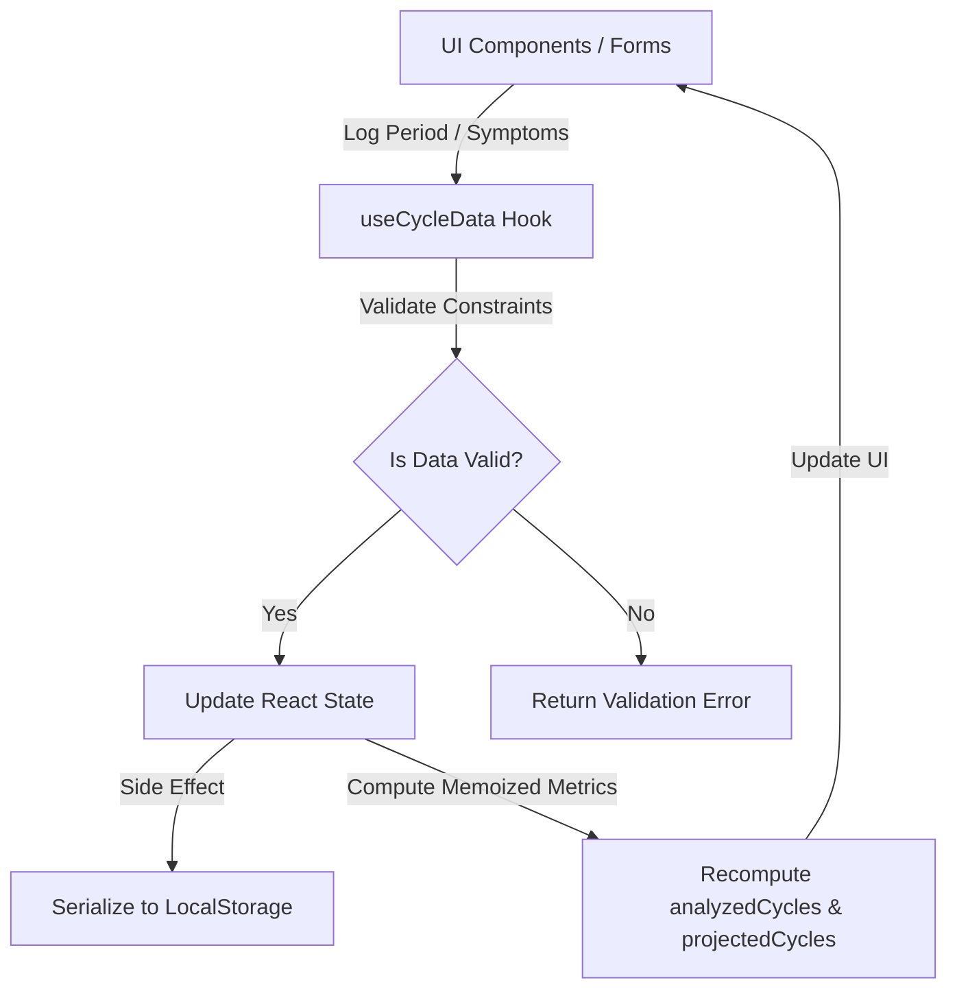

# React State Architecture & Shifting Grid Math

This document explains the software architecture, state lifecycle, and calendar coordinate geometry utilized in Selene.

---

## 1. Custom Hook State Management (`useCycleData.js`)

All state synchronization, data validation, and calculations are encapsulated inside the custom hook **`useCycleData`** (`src/hooks/useCycleData.js`). This isolates side-effects from the UI layout components.



### Key Responsibilities of `useCycleData.js`:
* **State Hook Lifecycle:** Houses primitive state bindings for `periods` (logged intervals) and `dailySymptoms` (indexed key-value pairs of dates to symptoms).
* **LocalStorage Serialization:** Automatically updates serialized state items when entries are created, modified, or deleted.
* **Memoization & Performance Optimization:** Uses React's `useMemo` hooks extensively to compile rolling averages, cycle logs, projections, and BBT curves. This prevents unnecessary recalculations during HMR (Hot Module Replacement) and state changes.

---

## 2. Collision & Overlap Prevention

Period start/end dates must represent continuous intervals. Overlapping ranges are biologically impossible and would break cycle average calculations. 

Selene prevents collisions by enforcing a mathematical boundary check before permitting any period save:
$$\text{Start}_A \le \text{End}_B \quad \land \quad \text{Start}_B \le \text{End}_A$$

```javascript
export function hasPeriodOverlap(periods, newPeriod, excludeIndex = -1, todayStr) {
  const { startDate: ns, endDate: ne, isOngoing: newOngoing } = newPeriod;
  const effectiveNe = newOngoing || !ne ? todayStr : ne;
  
  for (let i = 0; i < periods.length; i++) {
    if (i === excludeIndex) continue;
    const { startDate: es, endDate: ee, isOngoing: oldOngoing } = periods[i];
    const effectiveEe = oldOngoing || !ee ? todayStr : ee;
    
    // Check intersection interval boundary
    if (ns <= effectiveEe && es <= effectiveNe) {
      return true;
    }
  }
  return false;
}
```

---

## 3. Shifting Calendar Grid Geometry

In standard calendar grids, cell indexes are static. In Selene's **Cycle-Specific Grid View**, the layout shifts so that **Day 1 of the active cycle is positioned directly on its actual starting weekday column** (e.g. if the period started on a Thursday, Day 1 falls under `THU`), and all weekday headers (`SUN`–`SAT`) remain fixed.

```
Cycle starts on Thursday (April 18):
 SUN     MON     TUE     WED     THU     FRI     SAT
[Prev]  [Prev]  [Prev]  [Prev]  [Day 1] [Day 2] [Day 3] ...
                                (18th)  (19th)  (20th)
```

To render this consecutive timeline, the calendar grid calculates cell-by-cell offsets.

### The Coordinate Shift Equation:
For a grid row cell index $i$ (where $0 \le i < 42$):
1. **Find Weekday Column Start:** Let $W_{\text{start}}$ be the index of the weekday of the cycle's starting date (0 for Sunday, 6 for Saturday).
2. **Calculate Date Offset:** Shift the date index backwards by subtracting $W_{\text{start}}$:
   $$\text{offsetIndex} = i - W_{\text{start}}$$
3. **Render Target Date:** 
   $$\text{Cell Date} = \text{addDays}(\text{Cycle Start Date},\, \text{offsetIndex})$$

### Padding Cells Categorization:
* **Leading Padding Days ($\text{offsetIndex} < 0$):** Belong to the previous cycle. They are calculated dynamically using the preceding cycle's start date and are rendered with low opacity, labeled as `Prev · Day N`.
* **Active Cycle Days ($0 \le \text{offsetIndex} < L_{\text{cycle}}$):** Represent days within the current cycle. They are rendered with full opacity and labeled as `Day N`.
* **Trailing Padding Days ($\text{offsetIndex} \ge L_{\text{cycle}}$):** Belong to the subsequent cycle. They are rendered with low opacity, labeled as `Next · Day N`.

This structure keeps the days mathematically consecutive and preserves the visual layout of standard calendar weeks.
